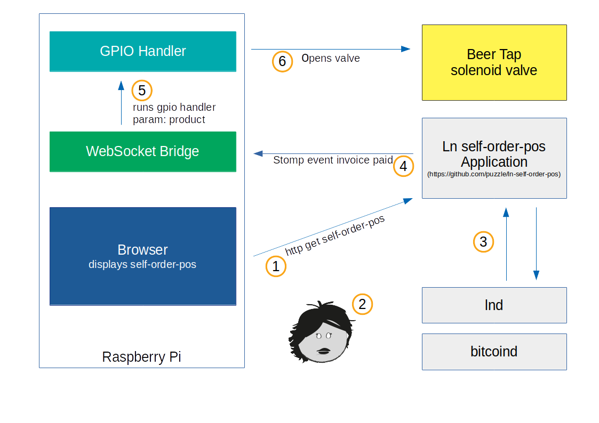
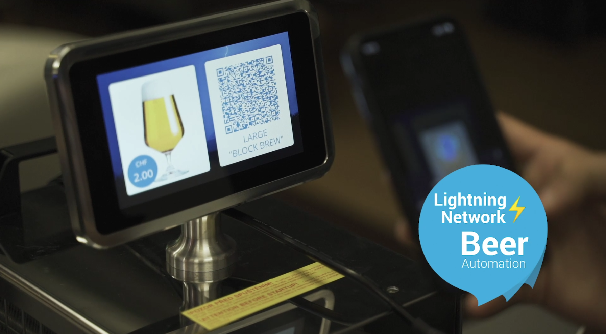
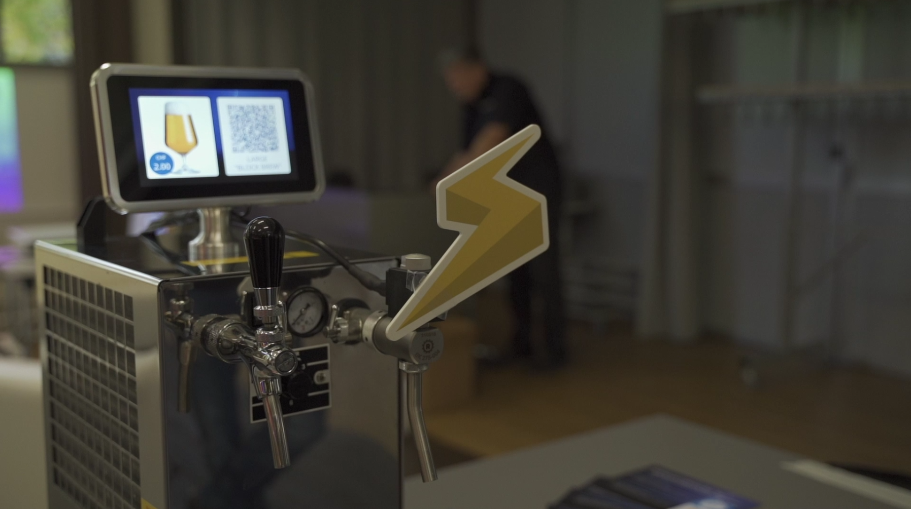
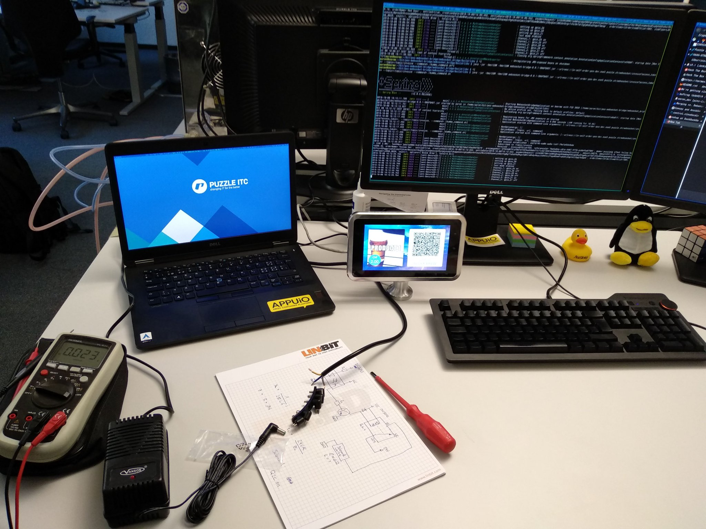

# Lightning powered beer tap

This project consists of multiple parts. To make things easier the `application.sh` provides a frontend to control everything. The different parts of the project are documented below.

## Architecture

The following diagram provides a general overview on how all the components work together




1. Basic Setup is done by running the `application.sh` shell script. (start Chromium in Kiosk mode, displays the self order pos webapplication in the Browser, starts the WebSocket Bridge
1. User scans and pays invoice
1. self-order pos gets notified that payment was successful
1. self-order pos application sends a stomp event to the websocket
1. WebSocket bridge runs the GPIO Handler with parameters about the product eg. small|large beer
1. GPIO Handler switches the relay for a certain amount of time (small beer 5 seconds, large beer 7 seconds)
**Important:** enjoy your beer, lightning pioneer!

The ln-self-order pos Application as well as lnd and bitcoind are not part of this project. Details about those can be found under https://github.com/puzzle/ln-self-order-pos

## Impressions

the final Lightning powered beer tap looks like this:







### Beer Tap in Action Video

Check out this [video](https://twitter.com/puzzleitc/status/1054770838984122368) if you want to see the tap in action.


## Parts list

To build your own lightning powered beer tap you'll need the follwing parts. We got most of our parts from distibutors located in switzerland, but you can get them anywhere you want.

| **Partname**                    | **Partnumber** | **Price / CHF**   |  **Distributor**          |
| :------------------------------ | --------------:| ----------------: | :------------------------ |
| Raspberry Pi 3 B+               |  10760         |  39               |  pi-shop.ch               |
| 32GB MicroSD Card               |  6613018       |  29.9             |  digitec.ch               |
| Original Rpi 7" Touchscreen     |  10266         |  79.9             |  pi-shop.ch               |
| PiggiPi 7’’ Display Mount       |  10399         |  48.9             |  pi-shop.ch               |
| Raspberry Pi Relay Board        |  10398         |  24.9             |  pi-shop.ch               |
| 24V AC Source (24W/50Hz)        |  169-84-752    |  22.7             |  distrelec.ch             |
| Beer tap with solenoid valve    |  08.00125      |  247.3            |  schankanlagenhandel.eu   |
| Bent faucet for beer tap        |  08.00128      |  22.51            |  schankanlagenhandel.eu   |

## Installation

This is straightforward. If you bought an empty micro-sd card, just download the latest [Raspbian image](https://www.raspberrypi.org/downloads/raspbian/).
* Fire up `dd` to load the image to your card.
* Use `sudo raspi-config` to extend your partitions, start openssh and enable the gpios.
* Follow the guide on [how to secure you raspberry pi](https://www.raspberrypi.org/documentation/configuration/security.md)
* Once you've deployed your ssh key and secured your acces, clone this repo.
* Install the necessary software to your pi by executing the following commands:
```bash
sudo apt-get update
sudo apt-get install -y  openjdk-8-jre openjdk-8-jdk unclutter vim
```
* Add your user to the group `gpio`
* You're all set and ready to go
* Clone the repository on your Raspberry Pi

# Aplication.sh start script

This script is used to start, stop or rebuild the application. Simple as that.
The websocket bridge will be automatically builded if you run `start` without a
previous build.

You might need to change the URL of your running ln-self-order-pos in the `application.sh` and dashboard `dashboard/dashboard.sh` files

```bash
$ ./application.sh start # starts the dashboard and websocket bridge
$ ./application.sh stop  # stops everything
$ ./application.sh build # rebuilds the java websocket bridge
```

# WebSocket Bridge

[README](./websocket_bridge/README.md)

# GPIO handler

To execute this python module the user has to be part of the group `gpio`.

## Dependencies

* RPi-GPIO (preinstalled on all raspberry pi distros)
* argparse

## how to run

```bash
$ python gpio_handler.py --product=[large,small] [--test, --memo="asdf"]
$ python gpio_handler.py --help
```
